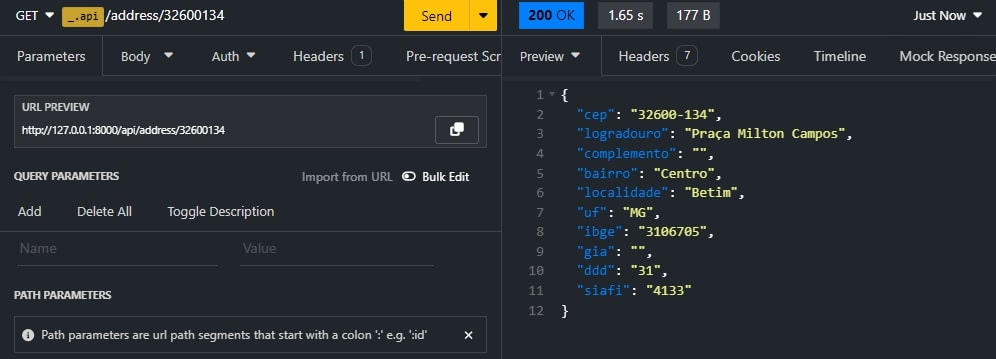
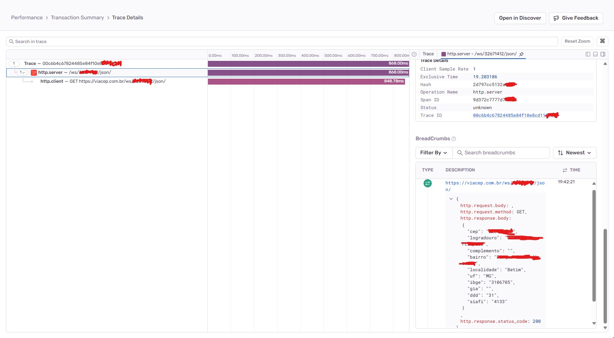

## Sobre

Esse código foi desenvolvido com o propósito de estudar sobre o envio de perfomance das requests para o sentry.

Para isso, desenvolvi um simples api, na qual quando informado o cep, irá me retornar o endereço daquele cep.

Ele funciona de maneira bem simples:

- É enviado uma request para a nossa api na rota de address, com isso, irá ser feita uma nova request na api da ViaCep, onde irá ser retornado o endereço.

    

- Durante a request é realizado um "acompanhamento" da request e enviado para o sentry!
- É enviado os dados como: status, body, header, request time... 
    
    

